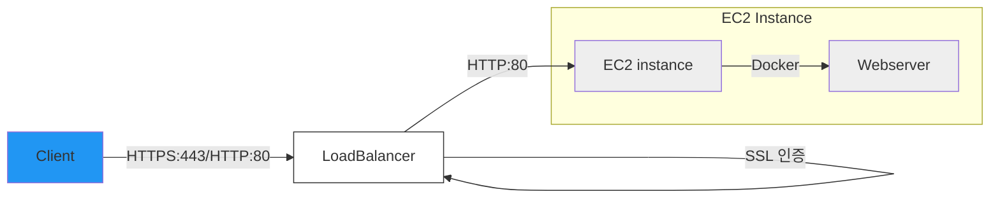

<h1 align="center">식기한 냉장고</h1>

<div align="center">
  <a href="https://sigkihan.com">
    🔗 서비스 바로가기
  </a>
</div>

## ✔ 프로젝트 소개

스마트한 냉장고 관리를 도와주는 모바일 웹 서비스입니다.<br />
식품의 유통기한을 추적하고 관리하여 음식물 낭비를 줄이고 효율적인 식품 관리를 가능하게 합니다.

## ✔ 주요 기능

- 🔐 카카오 소셜 로그인
- 📝 식품 등록/수정/삭제
- 🔔 유통기한 임박 알림
- 📊 식품 소비/폐기 관리
- 👤 프로필 관리

## ✔ 기술 스택

### 📘 Frontend

- React 18
- TypeScript
- Tailwind CSS

### 📘 State Management

- Zustand

### 📘 Package Manager

- NPM

### 📘 Development Tools

- ESLint
- Prettier

## 🏗 배포 환경

### 인프라 구조



### Docker 이미지 빌드

```bash
docker build -t sigkihan .
```

### Docker 컨테이너 실행

```bash
docker run -d -p 80:80 sigkihan
```

## ✔ 시작하기

### 조건

- Node.js 16.x 이상

### 설치

```bash
npm install
npm start
```
